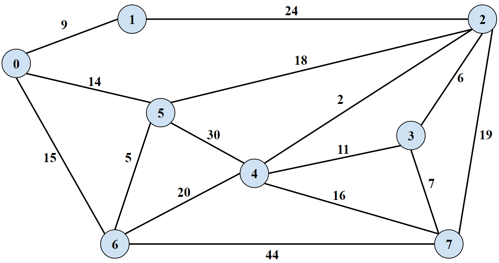
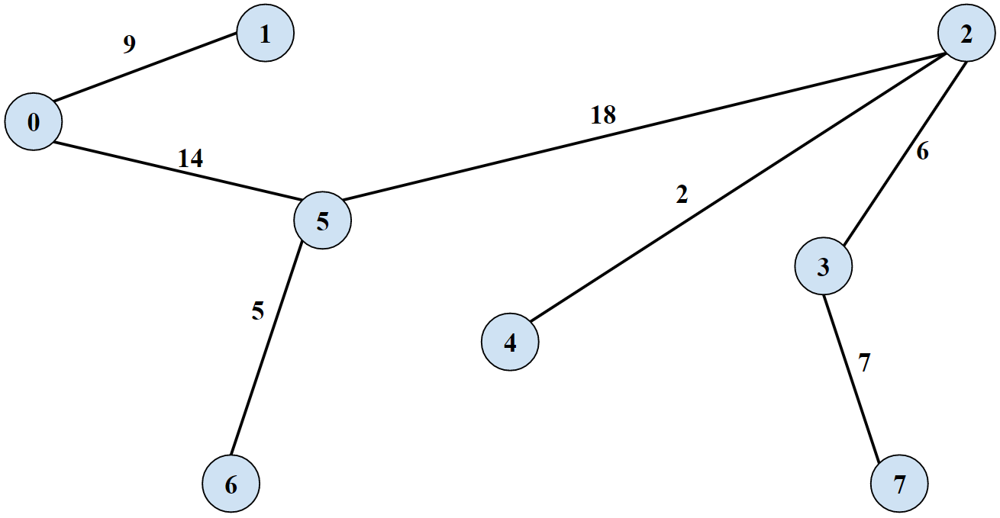

# Reverse Delete Algorithm (Minimum Spanning Tree)
Greedy Algorithm to find a minimum spanning tree in an undirected graph by deleting heaviest edges unless it would disconnect the graph

## Problem Statement
**Minim Spanning Tree:** a subset of nodes that touches all vertices while keeping all nodes connected and uses the sum of the edge weights in a minimum  
A Minimum spanning tree yields a graph with **M-1** edges because adding 1 more edge would by definition create a cycle

### Graph

### Minimum Spanning Tree
  
#### Weight = 18+14+9+7+6+5+2 = 61

## Reverse Delete Greedy Strategy
**Start with all edges in the tree T. Consider edges in descending order of weight. Delete edge from T unless doing so would disconnect T**

- Sort edges by weight
- Initialize MST with all edges
- Delete the highest weight edge
  - If deleting the edge disconnects the graph, add it back
  - Otherwise continue

## Usage
- Node names are consecutive integers starting from `0`
- Create a graph: `ArrayList<Edge> graph = new ArrayList<Edge>();`
- Graph undirected edge list, but **only add each edge once**
  - In the graph there is an edge from `0` to `9` with weight=`9`
  - This bidirectional edge can just be represented once: `graph.add(new Edge(0, 1, 9));`
- Count the vertices in the graph: `int vertexCount = 8;`
- Call the static method `ReverseDeleteMST.findMST(graph, vertexCount);`

# Code Notes
- Due to the implementation of Breadth First Search, the code creates an additional copy of the graph as an adjacency list
- This adjacency list graph is the one where edges are deleted, the original input graph as an edge list is left in tact
- The MST is technically built up from nothing and added to if deleting an edge in the adjacency list would disconnect the graph

## References
- [Kevin Wayne Slides](https://www.cs.princeton.edu/~wayne/kleinberg-tardos/pdf/04GreedyAlgorithmsII.pdf#page=14)
- [University of Illinois - Minimum Spanning Trees](https://courses.engr.illinois.edu/cs473/sp2011/Lectures/12_notes.pdf)
- [T. M. Murali Slides](http://courses.cs.vt.edu/cs5114/spring2009/lectures/lecture05-greedy-graph-algorithms.pdf#page=36)
- [Fan Chung Graham Slides](http://www.math.ucsd.edu/~fan/teach/202/14/04mst.pdf#page=11)
- [Reverse Delete Algorithm - GeeksForGeeks](http://www.geeksforgeeks.org/reverse-delete-algorithm-minimum-spanning-tree/) Algorithm strategy, code only briefly referenced
- [Remove items from ArrayList with certain value - Stack Overflow](https://stackoverflow.com/a/29107463/8132253) Lambda expression to delete specific value from `ArrayList`
